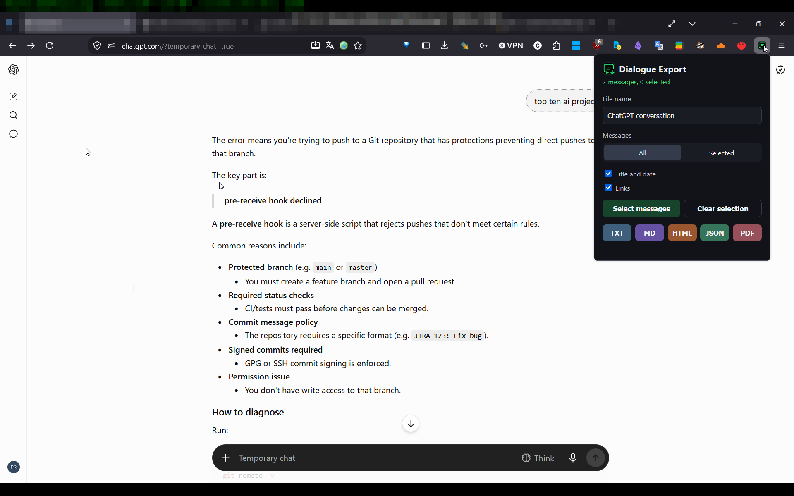
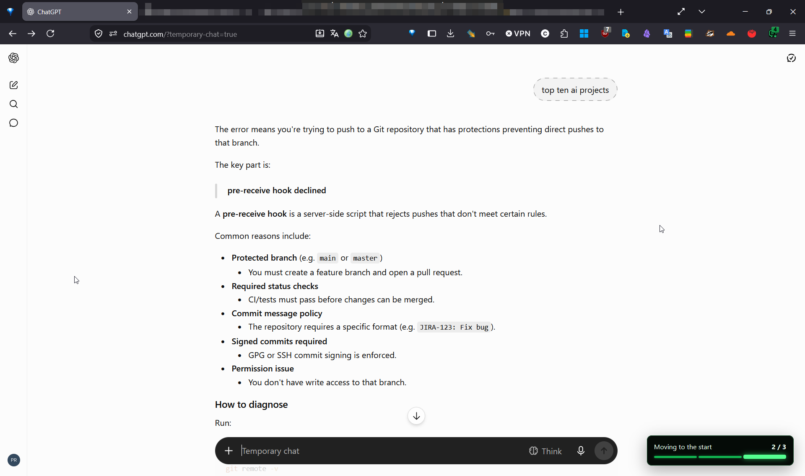

# Dialogue Export

Export complete conversations from `chatgpt.com` to Markdown, PDF, HTML, TXT, or JSON directly in Firefox.

Dialogue Export runs locally in the browser. Conversation content is never uploaded to a server and no analytics or telemetry are included.

## Features

- Export an entire open conversation.
- Select and export individual messages.
- Save as Markdown, PDF, HTML, TXT, or JSON.
- Preserve code blocks, tables, lists, links, writing blocks, editable text blocks, and readable embedded content.
- Scan long virtualized conversations automatically from beginning to end.
- Continue exporting after the extension popup is closed.
- Follow collection progress through a Matrix-green conversation timeline and toolbar badge.
- Generate a clean printable page for Firefox's **Save to PDF** function.
- Work completely locally without accounts, analytics, telemetry, or remote processing.

## Screenshots

### Export controls

### Export progress

## Compatibility

- Firefox 142 or later.
- Desktop Firefox.
- `https://chatgpt.com/` conversations.

Dialogue Export is an independent project and is not affiliated with or endorsed by OpenAI.

## Install

1. Open the [latest GitHub release](https://github.com/vaulthunt3r/dialogue-export/releases/latest).
2. Download `Dialogue-Export-v0.2.0.xpi`.
3. Open the downloaded file in Firefox and confirm the installation.

The XPI is signed by Mozilla and can be installed permanently in standard Firefox releases.

## Install from source

1. Download or clone this repository.
2. Open `about:debugging#/runtime/this-firefox` in Firefox.
3. Select **Load Temporary Add-on**.
4. Choose `manifest.json` from the project root.
5. Open or refresh a conversation on `chatgpt.com`.

Temporary source installations are removed when Firefox restarts.

## Usage

1. Open a conversation on `chatgpt.com`.
2. Select the Dialogue Export toolbar icon.
3. Choose all messages or selected messages.
4. Choose TXT, MD, HTML, JSON, or PDF.
5. Follow the timeline while the conversation is collected.

For PDF export, select **Save as PDF** on the generated print page and then choose Firefox's PDF destination.

## Privacy

Dialogue Export processes conversation content only in the local browser. It does not collect, transmit, sell, or share personal data. See [PRIVACY.md](PRIVACY.md).

## Project structure

- `content/extract.js` — conversation discovery, cleaning, and special-block extraction.
- `content/content.js` — collection workflow, message selection, scrolling, and progress timeline.
- `shared/renderers.js` — TXT, Markdown, HTML, JSON, and printable-document renderers.
- `background.js` — background downloads, PDF handoff, and toolbar progress.
- `popup/` — export controls.
- `print/` — Firefox print and PDF page.

## License

Dialogue Export is released under the [MIT License](LICENSE). Third-party icon information is available in [THIRD_PARTY_NOTICES.md](THIRD_PARTY_NOTICES.md).

Created with love by **vaulthunt3r**.
