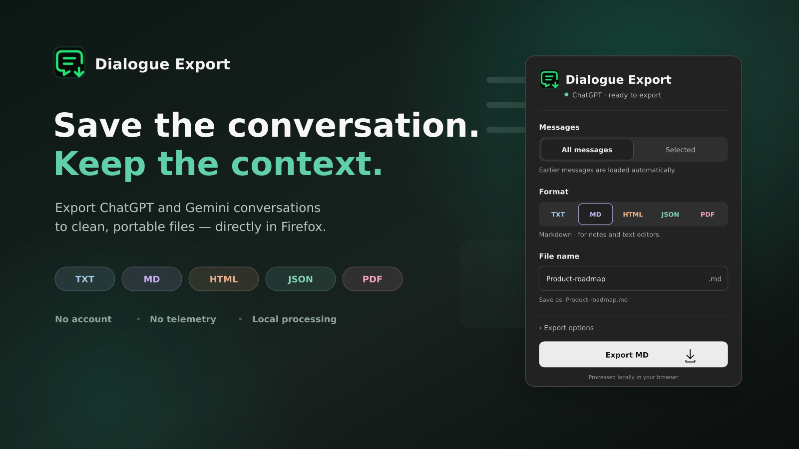
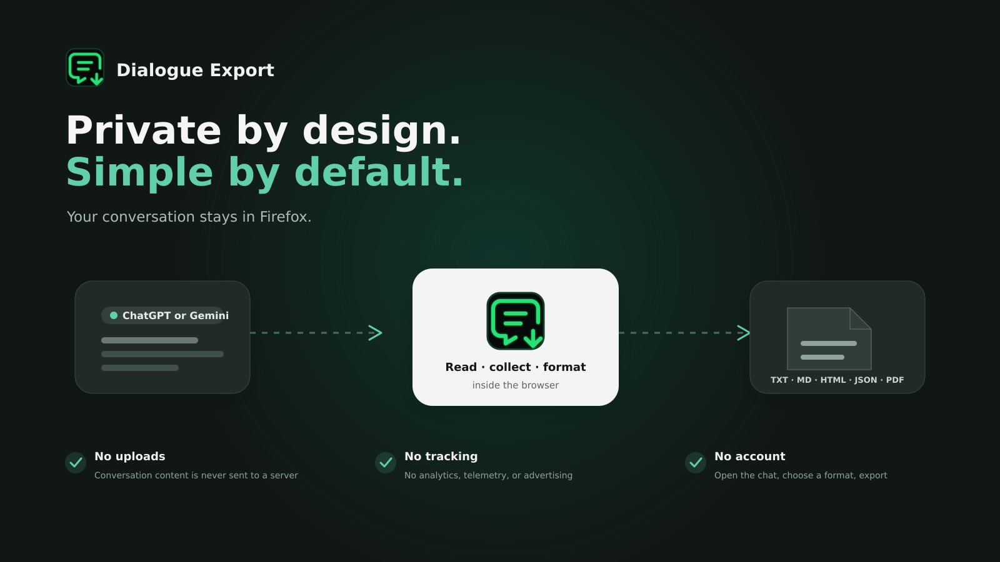

#  Dialogue Export

Dialogue Export is a Firefox extension for saving an open ChatGPT or Google Gemini conversation as TXT, Markdown, HTML, JSON, or PDF.

Everything is processed locally in Firefox. The extension does not upload conversations, use analytics, or send telemetry.

## 0.5.1 — optional message timestamps

This version adds the feature requested in [issue #1](https://github.com/vaulthunt3r/dialogue-export/issues/1). A Mozilla-signed installation package is included with this release as `Dialogue-Export-v0.5.1-signed.xpi`.

Open a ChatGPT conversation and enable **Export options → Include message timestamps**. The option is off by default and remembered for your next export.

- TXT and Markdown place the message's local date and time below the author.
- HTML and PDF display a small date/time line below the author.
- JSON stores `createdAt` in UTC ISO 8601 format, for example `2026-09-07T10:42:00.000Z`.
- If the page does not provide a message's creation time, its text is still exported. The document and completion status explain how many timestamps were available. JSON uses `createdAt: null` for missing times.
- The existing **Title and date in the document** option still controls the document's export date. It is separate from message timestamps.

Message timestamps currently support **ChatGPT only**. The control is disabled on Gemini with an explanation. Plain Gemini exports continue to work.

Dates are read from message metadata already present on the page and matched to the exact message ID. The extension makes no additional network requests. Internal website structures can change, so timestamp availability is not guaranteed. No time is invented or replaced with the export time.

See [the v0.5.1 verification notes](docs/TIMESTAMPS-v0.5.1.md) for tests and limitations.

## 0.5.0 — a clearer export interface

Version 0.5.0 makes exporting easier to follow. Choose a format, review your options, and press **Export**. A Mozilla-signed XPI is included in the release assets for permanent installation in Firefox 142 or later.

New in this version:

- Choose a format first, then use one explicit **Export** button.
- Remember the last format and export options.
- Preview the file name and optionally append today's date.
- Reconnect from the same popup if the conversation did not respond.
- See the current export stage, elapsed time, and collected-message count when reopening the popup.
- Show selection tools only in **Selected**, with a live count and **Clear** on the page. Press **Escape** to finish choosing.
- Follow page theme changes and show keyboard focus clearly.
- Carry the suggested PDF filename to the print page.

See [the frontend review](docs/FRONTEND_REVIEW_RU.md) for the findings, changes, and verification limits.

## Important update for v0.2.0 users

Version 0.2.0 could save only the part of a long ChatGPT conversation that was currently loaded on the page. ChatGPT removes older messages from the page while you scroll, so an export could look successful while still being incomplete.

Version 0.4.2 introduced the loading routine that was tested successfully during development. Dialogue Export moves through the conversation, requests earlier sections, and remembers discovered messages. Slow loading and website changes can still affect completeness; check the first and last messages in important exports.

If you installed v0.2.0, update to the latest release before exporting long conversations.

## Features

- Export the entire open conversation.
- Export only messages selected by the user.
- Support ChatGPT and Google Gemini.
- Save as TXT, Markdown, HTML, JSON, or PDF.
- Continue working after the popup is closed.
- Load and collect long ChatGPT conversations automatically.
- Preserve ordinary text, paragraphs, lists, and links.
- Keep link destinations in TXT, Markdown, HTML, PDF, and JSON.
- Use an interface that follows the conversation page's light or dark theme.
- Show export progress on the page and on the Firefox toolbar icon.
- Process everything locally with no accounts, analytics, or external servers.

## Interface and local processing

These presentation images illustrate the interface with fictional conversation data. For a working interface preview in light and dark themes, open `tests/preview.html` from the source archive.

## Supported websites

- `https://chatgpt.com/`
- `https://gemini.google.com/`

Dialogue Export is an independent project and is not affiliated with or endorsed by OpenAI or Google.

## Installation

### Permanent installation

1. Open the [latest GitHub release](https://github.com/vaulthunt3r/dialogue-export/releases/latest).
2. Download `Dialogue-Export-v0.5.1-signed.xpi` from the release assets.
3. Open the file in Firefox and confirm the installation.

A permanent installation requires a version signed by Mozilla. If the newest release does not contain a signed `.xpi` yet, use the temporary source installation below while it is being reviewed.

### Temporary installation from source

1. Extract `Dialogue-Export-v0.5.1.zip` (or the source archive).
2. Open `about:debugging#/runtime/this-firefox` in Firefox.
3. Select **Load Temporary Add-on**.
4. Choose `manifest.json` from the extracted folder.
5. Open or refresh a conversation on ChatGPT or Gemini.

Temporary installations are removed when Firefox restarts.

## How to use

1. Open a conversation on ChatGPT or Gemini.
2. Select the Dialogue Export icon on the Firefox toolbar.
3. Leave **All messages** selected to load and collect the open conversation.
4. To save only part of it, choose **Selected**, select **Choose messages**, and mark the required messages on the page.
5. Choose TXT, MD, HTML, JSON, or PDF. Selecting a format does not start an export.
6. Review the file name. Expand **Export options** to control the document title/date, links, message timestamps on ChatGPT, and date in the file name.
7. Click **Export TXT/MD/HTML/JSON** or **Prepare PDF**.
8. Keep the conversation tab open. You may close the popup and reopen it to see progress.
9. Complete Firefox's save dialog. “File sent to Firefox” confirms the handoff; check Downloads for the final result.

For PDF, Dialogue Export opens a printable page. Select **Save as PDF**, then choose Firefox's PDF destination. The print page uses your suggested filename; the final name can also be edited in Firefox.

## Format notes

- **TXT** is best for simple, readable text.
- **Markdown** adds headings for User and ChatGPT or Gemini and writes links as `[label](URL)`.
- **HTML** preserves more visual structure and clickable links.
- **JSON** contains message metadata, text, and cleaned HTML.
- **PDF** creates a print-friendly document through Firefox.

Dialogue Export is designed primarily for ordinary text conversations. Complex interactive canvases, generated applications, and some embedded media may not be reproduced exactly.

## Privacy

Conversation content is read only when the user starts an export. Processing occurs inside Firefox, and the result is passed directly to Firefox's download or print interface. See [PRIVACY.md](PRIVACY.md).

## Project structure

- `content/extract.js` — detects messages and prepares their content.
- `content/content.js` — handles collection, scrolling, selection, and progress.
- `shared/renderers.js` — creates TXT, Markdown, HTML, JSON, and printable output.
- `background.js` — handles downloads, PDF handoff, and the toolbar badge.
- `popup/` — extension controls.
- `print/` — printable PDF page.

## Development checks

Install the pinned development dependencies with `npm install`, then run `npm test` (Node.js 18 or later). These dependencies are for tests only; the extension has no runtime npm dependencies or build step.

The tests simulate WebExtension messages and page DOMs. They do not replace testing a signed extension, the real Firefox download/print dialogs, or a long conversation in a logged-in ChatGPT/Gemini session.

To validate an installation package with Mozilla's linter, run `npx web-ext lint --source-dir . --ignore-files 'tests/**' 'docs/**' 'package*.json'`. Keep test fixtures and development dependencies out of the package submitted for signing.

## License

Dialogue Export is released under the [MIT License](LICENSE). Third-party icon information is available in [THIRD_PARTY_NOTICES.md](THIRD_PARTY_NOTICES.md).

Created with love by **vaulthunt3r**.
